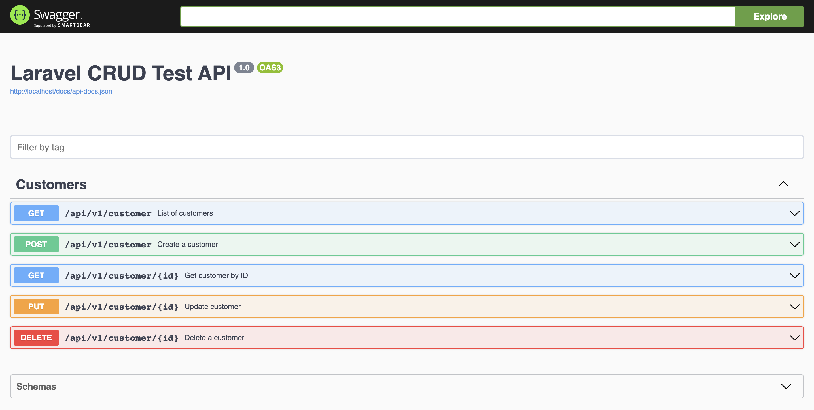

# Laravel CRUD Test 


## Patterns and features

✅ DDD

✅ TDD (Not enough)

✅ BDD

✅ CQRS

✅ Dockerized

✅ PHP 8.2.x

## Validations:

✅ During Create; validate the phone number to be a valid mobile number only

✅ A Valid email and a valid bank account number must be checked before submitting the form.

✅ Customers must be unique in database: By Firstname, Lastname and DateOfBirth.

✅ Email must be unique in the database.

## Storage
✅ Store the phone number in a database with minimized space storage.


## Presentation
✅ Swagger

✅ Web UI


## Project Structure (DDD):


```
src
├── Customer
│   ├── Application
│   │   ├── Providers
│   │   ├── Resources
│   │   ├── Rules
│   │   └── UseCases
│   │       ├── Commands
│   │       │   ├── Create
│   │       │   ├── Delete
│   │       │   └── Update
│   │       ├── Queries
│   │       │   ├── Get
│   │       │   └── Listing
│   │       └── Subscriber
│   ├── Domain
│   ├── Infrastructure
│   │   └── Elequent
│   │       ├── Factories
│   │       ├── Models
│   │       └── Repositories
│   └── Presentation
│       ├── API
│       │   └── V1
│       │       ├── Controllers
│       │       └── Requests
│       ├── CLI
│       └── HTTP
│           └── Controllers
└── Shared
    ├── Domain
    │   ├── Aggregate
    │   ├── Bus
    │   │   ├── Command
    │   │   ├── Event
    │   │   └── Query
    │   ├── Criteria
    │   └── ValueObject
    └── Infrastructure
        ├── Bus
        │   └── Messenger
        └── Eloquent

```

## TDD Results:


```shell
  PASS  Tests\Feature\Controllers\Customer\v1\CreateCustomerControllerTest
  ✓ create customer with valid request                                                                               0.92s  

   PASS  Tests\Feature\Controllers\Customer\v1\DeleteCustomerControllerTest
  ✓ delete customer                                                                                                  0.14s  

   PASS  Tests\Feature\Controllers\Customer\v1\GetCustomerByIdControllerTest
  ✓ get customer by id                                                                                               0.03s  

   PASS  Tests\Feature\Controllers\Customer\v1\UpdateCustomerControllerTest
  ✓ update customer                                                                                                  0.03s  

   PASS  Tests\Feature\Models\Customer\CustomerTest
  ✓ insert data                                                                                                      0.02s  

  Tests:    5 passed (13 assertions)
  Duration: 1.36s
```


## BDD Results:

```shell
Feature: Customer Management
    In order to manage customers
    As an API user
    I want to be able to perform CRUD operations on customers

  Scenario: Create customer                              # features/customer.feature:6
    Given I generate a random customer payload           # FeatureContext::generateRandomCustomerPayload()
    And I send a POST request to "/api/v1/customer"      # FeatureContext::sendPostRequest()
    Then the response status code should be 200          # FeatureContext::assertResponseStatusCode()
    And the response should be in JSON                   # FeatureContext::assertResponseIsJson()
    And the response body should have a "customer" key   # FeatureContext::assertResponseBodyHasKey()
    And the "customer" key should have a "id" field      # FeatureContext::theKeyShouldHaveAField()
    And I store the value of "id" statically as "userId" # FeatureContext::iStoreTheValueOfStaticallyAs()

  Scenario: Get customer info by ID                         # features/customer.feature:16
    And I send a GET request to "/api/v1/customer/{userId}" # FeatureContext::sendGetRequest()
    Then the response status code should be 200             # FeatureContext::assertResponseStatusCode()
    And the response should be in JSON                      # FeatureContext::assertResponseIsJson()
    And the response body should have a "customer" key      # FeatureContext::assertResponseBodyHasKey()

  Scenario: List customers                              # features/customer.feature:22
    Given I send a GET request to "/api/v1/customer"    # FeatureContext::sendGetRequest()
    Then the response status code should be 200         # FeatureContext::assertResponseStatusCode()
    And the response should be in JSON                  # FeatureContext::assertResponseIsJson()
    And the response body should have a "customers" key # FeatureContext::assertResponseBodyHasKey()

  Scenario: Update customer                                 # features/customer.feature:28
    Given I generate a random updated customer payload      # FeatureContext::generateRandomUpdatedCustomerPayload()
    And I send a PUT request to "/api/v1/customer/{userId}" # FeatureContext::sendPutRequest()
    Then the response status code should be 200             # FeatureContext::assertResponseStatusCode()
    And the response should be in JSON                      # FeatureContext::assertResponseIsJson()
    And the response body should have a "customer" key      # FeatureContext::assertResponseBodyHasKey()

  Scenario: Delete customer                                    # features/customer.feature:35
    And I send a DELETE request to "/api/v1/customer/{userId}" # FeatureContext::sendDeleteRequest()
    Then the response status code should be 204                # FeatureContext::assertResponseStatusCode()
    And the response should be empty                           # FeatureContext::assertResponseIsEmpty()

5 scenarios (5 passed)
23 steps (23 passed)
```

## API Documentation
This project utilizes the power of **Swagger** to enhance the development and documentation process. Swagger, now known as OpenAPI 3, is an industry-standard specification for building and documenting RESTful APIs.



## Requirements:

- PHP 8.2.x
- darkaonline/l5-swagger (documentation)
- propaganistas/laravel-phone (validate phone)
- laravel/sail (dockerize)
- behat/behat (BDD)

